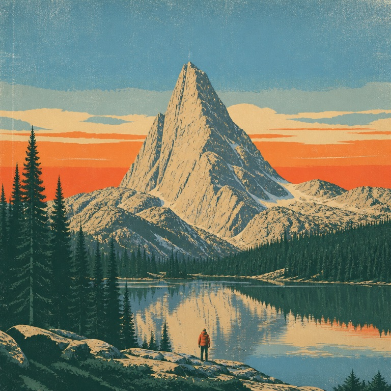

# style-contract

A Claude Code skill that stops AI images from all looking like AI images.

Ask a model for ten images and you get ten styles, most of them the same glossy default. This skill makes Claude write a **style contract** for your project (finish, palette with exact hexes, composition, subject rules, mood, and two to four modes), save it as `STYLE.md`, and then write every image prompt from it and check every result against it.

Works with GPT Image, Nano Banana, Seedream, Midjourney, Flux and anything else that takes a text prompt.

Same model (GPT Image 2), same subject. Left: a plain prompt. Right: the prompt written from a style contract.

| Plain prompt | With `presets/riso-zine.md` |
| --- | --- |
|  |  |

| Plain prompt | With `presets/park-poster.md` |
| --- | --- |
|  |  |

The exact prompts are in each preset's *Example prompt* section.

## Install

```bash
git clone https://github.com/tk1475/style-contract ~/.claude/skills/style-contract
```

Then in any project, ask Claude something like:

- "Make a style contract from our brand guide" (attach the PDF or a URL)
- "Use the riso-zine preset and give me a hero image prompt for the pricing page"
- "Here are 4 images I like. Turn them into a style contract."
- "Check these renders against STYLE.md"

## What is in it

| Path | What |
| --- | --- |
| `SKILL.md` | The workflow: build or load a contract, pick a mode, write the prompt, run the pre-flight check |
| `templates/STYLE.template.md` | The blank contract Claude fills in for your project |
| `presets/riso-zine.md` | Fluorescent risograph zine look |
| `presets/park-poster.md` | Mid-century screen-printed park poster look |

Presets are welcome as pull requests: one Markdown file in `presets/`, following the template, with one example prompt.

## License

MIT
