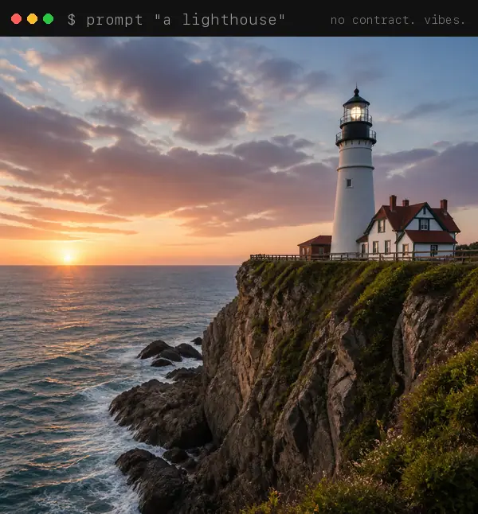
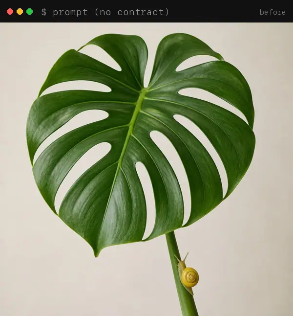
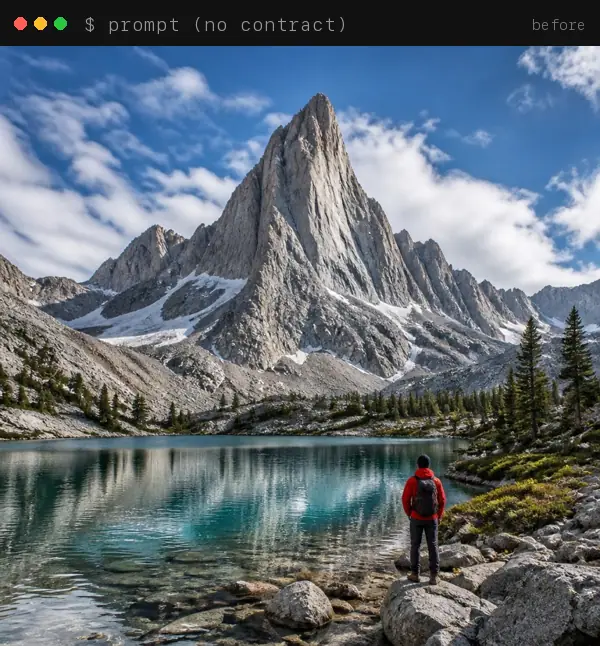
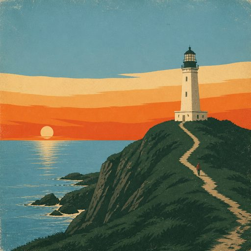
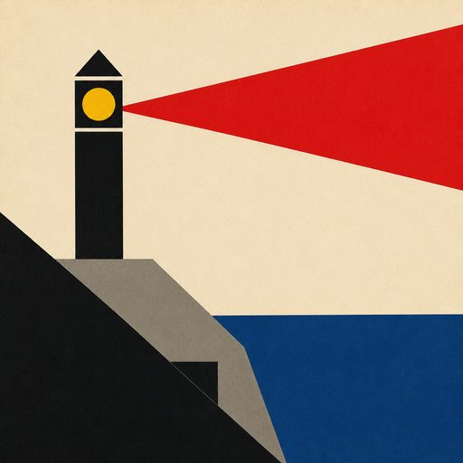
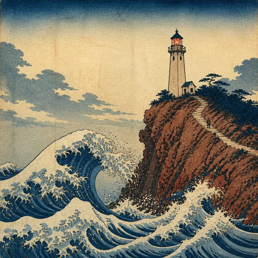
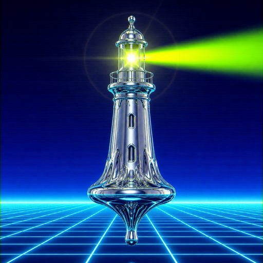

<p align="center">
  
</p>

<h1 align="center">style-contract</h1>

<p align="center">
  <b>A type system for vibes.</b><br>
  A Claude Code skill that makes every AI image obey one <code>STYLE.md</code>.
</p>

---

Ask a model for ten images and you get ten styles, all the same glossy default. This fixes that.

```text
you     make a style contract from our brand guide
claude  writes STYLE.md: finish, palette, composition, subject, mood, modes
you     hero image for the pricing page
claude  writes the prompt from STYLE.md, then grades the render against it
```

<table>
  <tr>
    <td></td>
    <td></td>
  </tr>
  <tr>
    <td align="center"><sub>same model, same subject, <code>+ riso-zine.md</code></sub></td>
    <td align="center"><sub>same model, same subject, <code>+ park-poster.md</code></sub></td>
  </tr>
</table>

## Install

In Claude Code:

```text
/plugin marketplace add tk1475/style-contract
/plugin install style-contract@style-contract
```

Or as a plain skill:

```bash
git clone https://github.com/tk1475/style-contract ~/.claude/skills/style-contract
```

Claude loads it whenever you talk about images.

## Say things like

```text
use the bauhaus preset, give me 3 blog headers
here are 4 images I like. reverse-engineer a contract
grade these renders against STYLE.md
```

## Presets

| [riso-zine](presets/riso-zine.md) | [park-poster](presets/park-poster.md) | [bauhaus](presets/bauhaus.md) | [ukiyo-e](presets/ukiyo-e.md) | [y2k-chrome](presets/y2k-chrome.md) |
| :-: | :-: | :-: | :-: | :-: |
|  |  |  |  |  |

Or skip presets and let Claude build yours from a brand guide, a URL, or a moodboard.

Works with GPT Image, Nano Banana, Seedream, Midjourney, Flux, and anything else that eats text.

## More

- [How it works](docs/how-it-works.md): the five clauses, and why models actually listen
- [Preset gallery](presets/README.md): every preset, with its prompt
- [Add a preset](CONTRIBUTING.md): one Markdown file, one PR

<sub>MIT. Every example image was made with GPT Image 2 from the prompts in <code>presets/</code>. No cherry-picking beyond one render each.</sub>
