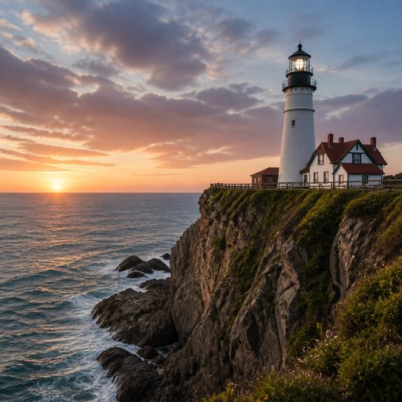

# Preset gallery

Same prompt every time: *a lighthouse on a cliff above the sea.* Only the contract changes.

| | Preset | Vibe |
| :-: | --- | --- |
|  | *(none)* | the default. you have seen it a thousand times |
|  | [riso-zine](riso-zine.md) | two fluorescent inks, slightly misregistered, very zine |
|  | [park-poster](park-poster.md) | 1950s screen print, stepped sky, total calm |
|  | [bauhaus](bauhaus.md) | circles, triangles, primary colours, a ruler |
|  | [ukiyo-e](ukiyo-e.md) | woodblock print, and the sea wants to eat you |
|  | [y2k-chrome](y2k-chrome.md) | liquid chrome, 1999 screensaver, one lens flare |

Each file has the full contract and a copy-paste example prompt.

Want your own? Tell Claude "make a style contract" and point it at a brand guide, a URL or a few images. Want to share it? See [CONTRIBUTING](../CONTRIBUTING.md).
